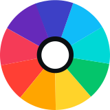

# <p class="text-xl italic geometric m-0"><span class="text-blue">Co</span><span class="text-green">ol</span></span><span class="text-red">Ne</span><span class="text-yellow">UI</span></p>
## Art Made Easy

**CoolNeUI** is a free and open-source **UI framework** developed by **CoolBeachBall**.

The tool uses *HTML classes* to style a website!
Without relying on *CSS*.
*CSS* is optional.


---

## What is CoolNeUI? 🤔
I am telling you what, when you want to build a website and you want to make it look good but *CSS* is hard and trust me there are a lot of websites that look aweful! Not just because they're bad at design, but because of how hard is to make a website using *CSS*.


**CoolNeUI** fixes these issues by giving already built components that will allow you to your website to not just look prettty, but also to build fast and responsive!

Don't worry!
**CoolNeUI** is undoubtly one of the easiest UI frameworks out there!
It's so easy! You can just learn it in an afternood by just reading this documentation below.

And that is the power of **CoolNeUI**! 
it makes designing websites effortless.


**CoolNeUI**
Art made easy.


### Example:
Here is an example of **CoolNeUI** used in *HTML* code:

```html
<h1 class="text-red">Hello World!</h1>
<p class="bg-blue">Welcome to my website!</p>
<button class="btn-yellow">Click!</button>
```

Renders as:

```html
<h1 style="color: red;">Hello World!</h1>
<p style="background-color: blue;">Welcome to my website!</p>
<button style="background-color: yellow;">Click!</button>
```

**Wow! It's that simple!**
With just three classes, your website becomes visually stunning!

---

## what is its Mission?
As I, **CoolBeachBall** CoolNeUI's developer, my mission is to make *Web development* simple and intuitive, to bring your ideas to come to life.
To be so easy, by just first think then do then it's done!

I hope you are going to have fun using **CoolNeUI** on you prodjects!

### Honest Facts

Even though you can make a website by just using **CoolNeUI**, it still doesn't fully replace *CSS*.
At some point you will need some *CSS* for complex design.

But don't worry! **CoolNeUI** has everything you need to build a stunning looking website!

And **CoolNeUI** is still developing!
So stay tuned fro more features to come!

## What Does CoolNeUI Offer? 📦

**CoolNeUI** provides all the bare necesities to be able to build a pretty website, quick and easy with minimal code!

Here are some that might inrerest you:

### 1. **12 stunning Colors**
- <span style="background-color: #FF2D55">pink</span>
- <span style="background-color: #FF3B30">red</span>
- <span style="background-color: #FF9500">orange</span>
- <span style="background-color: #FFCC00; color: #222224">yellow</span>
- <span style="background-color: #4CD964">green</span>
- <span style="background-color: #5AC8FA">aqua</span>
- <span style="background-color: #34AADC">sky</span>
- <span style="background-color: #007AFF">blue</span>
- <span style="background-color: #5856D6">violet</span>
- <span style="background-color: #8E8E93">gray</span>
- <span style="background-color: #222224">dark</span>
- <span style="background-color: #F3F3FC; color: #222224">light</span>

**including metal colors 🤟**
- <span style="background-color: #29292C">lead</span>
- <span style="background-color: #444449">steel</span>
- <span style="background-color: #6E6E74">iron</span>
- <span style="background-color: #8E8E93">titanium</span>
- <span style="background-color: #C2C2C9">silver</span>
- <span style="background-color: #E5E5ED; color: #222224">platinum</span>

### 2. **16 pretty Fonts**
- <span style="sans-serif">sans-serif</span>
- <span style="serif">serif</span>
- <span style="monospace">monospace</span>
- <span style="cursive">cursive</span>
- <span style="fantasy">fantasy</span>
- <span style="italic">italic</span>
- <span style="boldf">bold</span>
- <span style="underline">underline</span>
- <span style="slab-serif">slab-serif</span>
- <span style="modern-serif">modern-serif</span>
- <span style="ultrathin">ultrathin</span>
- <span style="bubble">bubble</span>
- <span style="script">script</span>
- <span style="geometric">geometric</span>
- <span style="vintage">vintage</span>
- <span style="impact">impact</span>

### 3. **6 Sizes**
- <span style="text-xxl">xxl</span>
- <span style="text-xl">xl</span>
- <span style="text-lg">lg</span>
- <span style="text-md">md</span>
- <span style="text-sm">sm</span>
- <span style="text-xs">xs</span>

### 4. **it has Geometry**
CoolNeUI supports size classes for both horizontal (`x-*`) and vertical (`y-*`) dimensions. Examples:
- `x-100` for 100% width
- `y-50` for 50% height

### 5. **Pre-Built Components**
CoolNeUI includes ready-to-use UI components, so you can get started quickly.

### 6. **Animations**
Give life to you website with the help of animations!

---

## Why Use CoolNeUI?
**CoolNeUI** is simple yet powerful. It focuses on:
- Speed: Get your website styled quickly.
- Customization: Adjust styles to fit your needs.

Compatible with:
- **HTML5** projects
- JavaScript frameworks like **React**, **Vue**, **Angular**, and **Svelte**.

---

## How to Get Started
To start using **CoolNeUI**, follow this documentation to:
1. Install it as an **NPM package**.
2. Set it up in your project.
3. Learn its features through practical examples.

Stay tuned and happy learning!

---

## Installation

### Install via NPM
```bash
npm install coolneui
```

### Add to Your Project
Include the stylesheet in your HTML file:

```html
<link rel="stylesheet" href="./coolneui.css" />
```

---

## Content:

**Basics**
1. <a href="#chapter-1">overview</a>
2. <a href="#chapter-2">colors</a>
3. <a href="#chapter-3">fonts</a>
4. <a href="#chapter-4">sizes</a>
5. <a href="#chapter-5">text position</a>
6. <a href="#chapter-6">box model</a>
7. <a href="#chapter-7">text size</a>
8. <a href="#chapter-8">borders</a>
9. <a href="#chapter-9">shades</a>
10. <a href="#chapter-10">rounding</a>
11. <a href="#chapter-11">opacity</a>
12. <a href="#chapter-12">display</a>
13. <a href="#chapter-13">rotation</a>
14. <a href="#chapter-14">list</a>
15. <a href="#chapter-15">flexbox</a>
16. <a href="#chapter-16">gradients</a>
17. <a href="#chapter-17">z axis</a>
18. <a href="#chapter-18">position</a>

**components**
1. <a href="#one">badge</a>
2. <a href="#two">button</a>
3. <a href="#three">link</a>
4. <a href="#four">card</a>
5. <a href="#five">layout</a>

**animations**
5. <a href="#animations">animations</a>


## CoolNeUI Course by CoolBeachBall
Hi! I'm **CoolBeachBall**, and I'll teach you all the concepts of CoolNeUI.

<section id="chapter-1"></section>

### Chapter 1: Overview
CoolNeUI focuses on classes. If you're unfamiliar, a class is an attribute used to style specific elements in HTML. Add a class attribute with a predefined name, and the styles will automatically apply.

Example:
```html
<p class="text-blue">Blue Text</p>
```
<p class="text-blue">Blue Text</p>
As you can see above, that is the output you'll see on your website project.

#### Usage
To apply a color:
- For background: Use `bg-{color}`.
- For text: Use `text-{color}`.

Example:
```html
<p class="bg-pink">Pink Background</p>
<p class="text-blue">Blue Text</p>
```

<p class="bg-pink">Pink Background</p>
<p class="text-blue">Blue Text</p>

<section id="chapter-ii"></section>

## Chapter 2
**Colors** 🌈


CoolNeUI has 14 colors, which are:

- <span class="badge-pink">pink</span>
- <span class="badge-red">red</span>
- <span class="badge-orange">orange</span>
- <span class="badge-yellow">yellow</span>
- <span class="badge-green">green</span>
- <span class="badge-aqua">aqua</span>
- <span class="badge-sky">sky</span>
- <span class="badge-blue">blue</span>
- <span class="badge-violet">violet</span>
- <span class="badge-gray">gray</span>
- <span class="badge-dark">dark</span>
- <span class="badge-light">light</span>

it even has **transparent**
- <span class="badge-transparent">transparent</span>

there are many ways you can use colors.

here are 2 ways:

- background-color --> *bg*
- text-color --> *text*

Simple! 
To each one of them to add a color you'll want to add a highphen after it and then the color you want

**⚠️ WARNING!**: if you try to separate the class-values will not make the code to appear, that's because
HTML percepts the class-values as different classes, so make sure you add a highphen after every element you want to initialise with a specific custom class.

**Background Color**
*bg* stands for background. So you want the background to the color you want, 
for that you'll add a any of the color I showed above.

example : **bg-*(color)***

```html
<p>
    <span class="bg-pink">bg-pink</span><br />
    <span class="bg-red">bg-red</span><br />
    <span class="bg-orange">bg-orange</span><br />
    <span class="bg-yellow">bg-yellow</span><br />
    <span class="bg-green">bg-green</span><br />
    <span class="bg-aqua">bg-aqua</span><br />
    <span class="bg-sky">bg-sky</span><br />
    <span class="bg-blue">bg-blue</span><br />
    <span class="bg-violet">bg-violet</span><br />
    <span class="bg-gray">bg-gray</span><br />
    <span class="bg-dark">bg-dark</span><br />
    <span class="bg-light">bg-light</span><br />
</p>
```

example output 👇:

<p>
    <span class="bg-pink">bg-pink</span><br />
    <span class="bg-red">bg-red</span><br />
    <span class="bg-orange">bg-orange</span><br />
    <span class="bg-yellow">bg-yellow</span><br />
    <span class="bg-green">bg-green</span><br />
    <span class="bg-aqua">bg-aqua</span><br />
    <span class="bg-sky">bg-sky</span><br />
    <span class="bg-blue">bg-blue</span><br />
    <span class="bg-violet">bg-violet</span><br />
    <span class="bg-gray">bg-gray</span><br />
    <span class="bg-dark">bg-dark</span><br />
    <span class="bg-light">bg-light</span><br />
</p>

replace the both parenthesis and color with any color.

Here I will make a rainbow, follow up the examples.


You noticed that the elements change the color of the text into other colors!
Yes! that is the default! it was meant to add less code and just automatically change into their respective text color.

example: `bg-red` = `bg-red` `text-light`.

If you want to add custom color for the text you can use text-(color) after the background (for that you don't have to add another highphen just space).

Now that you understand how the background works! try it yourself!

**Text Color**
Same with *bg*, *text* will make the text into specific color.

example: `text-{color}`

```html
<p>
    <span class="text-pink">text-pink</span><br />
    <span class="text-red">text-red</span><br />
    <span class="text-orange">text-orange</span><br />
    <span class="text-yellow">text-yellow</span><br />
    <span class="text-green">text-green</span><br />
    <span class="text-aqua">text-aqua</span><br />
    <span class="text-sky">text-sky</span><br />
    <span class="text-blue">text-blue</span><br />
    <span class="text-violet">text-violet</span><br />
    <span class="text-gray">text-gray</span><br />
    <span class="text-dark">text-dark</span><br />
    <span class="text-light">text-light</span><br />
</p>
```

<p>
    <span class="text-pink">text-pink</span><br />
    <span class="text-red">text-red</span><br />
    <span class="text-orange">text-orange</span><br />
    <span class="text-yellow">text-yellow</span><br />
    <span class="text-green">text-green</span><br />
    <span class="text-aqua">text-aqua</span><br />
    <span class="text-sky">text-sky</span><br />
    <span class="text-blue">text-blue</span><br />
    <span class="text-violet">text-violet</span><br />
    <span class="text-gray">text-gray</span><br />
    <span class="text-dark bg-light">text-dark</span><br />
    <span class="text-light bg-dark">text-light</span><br />
</p>


**CoolNeUI** has one of the most widely used colors by default!
Those colors bring life to your website and the colors are made perfectly to match together.

But what if you want to do a website that is mostly green, or red or blue etc... ?

Well there are way to shade the colors.

there are two ways: 

**lighting the colors**
- `light`
- `light-1`
- `light-2`

**darkening the colors**
- `dark`
- `dark-1`
- `dark-2`


your can color any color except: `dark`, `light` & `transparent` (obviously).


here are some examples:

```html
<span class="bg-red-dark-2">red-dark-2</span>
<span class="bg-red-dark-1">red-dark-1</span>
<span class="bg-red-light">red-light</span>
<span class="bg-red">red</span>
<span class="bg-red-dark">red-dark</span>
<span class="bg-red-dark-1">red-dark-1</span>
<span class="bg-red-dark-2">red-dark-2</span>
```


<section id="chapter-3"></section>

## Chapter 3
**Fonts** 🖋


Fonts are easy! unlike with *bg* or *text*, you don't have to use a propert and then the value!
You can just use one value.


here are all the 16 fonts:

- <span class="sans-serif">sans-serif</span><br />
- <span class="serif">serif</span><br />
- <span class="monospace">monospace</span><br />
- <span class="cursive">cursive</span><br />
- <span class="fantasy">fantasy</span><br />
- <span class="italic">italic</span><br />
- <span class="bold">bold</span><br />
- <span class="underline">underline</span><br />
- <span class="slab-serif">slab-serif</span><br />
- <span class="modern-serif">modern-serif</span><br />
- <span class="ultrathin">ultrathin</span><br />
- <span class="bubble">bubble</span><br />
- <span class="script">script</span><br />
- <span class="geometric">geometric</span><br />
- <span class="vintage">vintage</span><br />
- <span class="impact">impact</span><br />

```html
<p>
    - <span class="sans-serif">sans-serif</span><br />
    - <span class="serif">serif</span><br />
    - <span class="monospace">monospace</span><br />
    - <span class="cursive">cursive</span><br />
    - <span class="fantasy">fantasy</span><br />
    - <span class="italic">italic</span><br />
    - <span class="bold">bold</span><br />
    - <span class="underline">underline</span><br />
</p>
```

<p>
    - <span class="sans-serif">sans-serif</span><br />
    - <span class="serif">serif</span><br />
    - <span class="monospace">monospace</span><br />
    - <span class="cursive">cursive</span><br />
    - <span class="fantasy">fantasy</span><br />
    - <span class="italic">italic</span><br />
    - <span class="bold">bold</span><br />
    - <span class="underline">underline</span><br />
</p>

```html
<p>
    - <span class="slab-serif">slab-serif</span><br />
    - <span class="modern-serif">modern-serif</span><br />
    - <span class="ultrathin">ultrathin</span><br />
    - <span class="bubble">bubble</span><br />
    - <span class="script">script</span><br />
    - <span class="geometric">geometric</span><br />
    - <span class="vintage">vintage</span><br />
    - <span class="impact">impact</span><br />
</p>
```
<p>
    - <span class="slab-serif">slab-serif</span><br />
    - <span class="modern-serif">modern-serif</span><br />
    - <span class="ultrathin">ultrathin</span><br />
    - <span class="bubble">bubble</span><br />
    - <span class="script">script</span><br />
    - <span class="geometric">geometric</span><br />
    - <span class="vintage">vintage</span><br />
    - <span class="impact">impact</span><br />
</p>

```
**💥 Pro Tip**: you can combine two fonts at once! only with: bold, italic & underline.
example: cursive italic bold.
```

```html
<p class="cursive bold italic underline">
    cursive bold italic underline
</p>
```

<p class="cursive bold italic underline">
    cursive bold italic underline
</p>

<section id="chapter-4"></section>

## Chapter 4
**sizes** 📏

Sizes has an x and y axis.
if you listened to your Geometry teacher, you would know that x is left and right and y is up and down.

the Sizes' values goes into a twelfth formation.

which are the following lengths:

- `100`  (full)
- `92`   (eleven-twefths)
- `90`   (nine-tenths)
- `87`   (seven-eighths)
- `83`   (five-sixths)
- `80`   (four-fifths)
- `75`   (three-fourths)
- `66`   (two-thirds)
- `50`   (half)
- `33`   (one-third)
- `25`   (one-fourth)
- `20`   (one-fifth)
- `16`    (one-sixth)
- `12`   (one-eighth)
- `10`    (one-tenth)
- `8`     (one-twelfth)

To customize the length of the element you'll use either x or y.

here is an example:
```html
<div class="x-100">
    <p class="x-100 bg-red">100%</p>
    <p class="x-92 bg-orange">92%</p>
    <p class="x-90 bg-yellow">90%</p>
    <p class="x-87 bg-green">87%</p>
    <p class="x-83 bg-aqua">83%</p>
    <p class="x-80 bg-sky">80%</p>
    <p class="x-75 bg-blue">75%</p>
    <p class="x-66 bg-violet">66%</p>
    <p class="x-50 bg-red">50%</p>
    <p class="x-33 bg-orange">33%</p>
    <p class="x-25 bg-yellow">25%</p>
    <p class="x-20 bg-green">20%</p>
    <p class="x-16 bg-aqua">16%</p>
    <p class="x-12 bg-sky">12%</p>
    <p class="x-10 bg-blue">10%</p>
    <p class="x-8 bg-violet">8%</p>
</div>
```
 
<div class="x-100">
    <p class="x-100 bg-red">100%</p>
    <p class="x-92 bg-orange">92%</p>
    <p class="x-90 bg-yellow">90%</p>
    <p class="x-87 bg-green">87%</p>
    <p class="x-83 bg-aqua">83%</p>
    <p class="x-80 bg-sky">80%</p>
    <p class="x-75 bg-blue">75%</p>
    <p class="x-66 bg-violet">66%</p>
    <p class="x-50 bg-red">50%</p>
    <p class="x-33 bg-orange">33%</p>
    <p class="x-25 bg-yellow">25%</p>
    <p class="x-20 bg-green">20%</p>
    <p class="x-16 bg-aqua">16%</p>
    <p class="x-12 bg-sky">12%</p>
    <p class="x-10 bg-blue">10%</p>
    <p class="x-8 bg-violet">8%</p>
</div>

```html
<div class="flex between x-100">
    <p class="y-100 bg-red">100%</p>
    <p class="y-92 bg-orange">92%</p>
    <p class="y-90 bg-yellow">90%</p>
    <p class="y-87 bg-green">87%</p>
    <p class="y-83 bg-aqua">83%</p>
    <p class="y-80 bg-sky">80%</p>
    <p class="y-75 bg-blue">75%</p>
    <p class="y-66 bg-violet">66%</p>
    <p class="y-50 bg-red">50%</p>
    <p class="y-33 bg-orange">33%</p>
    <p class="y-25 bg-yellow">25%</p>
    <p class="y-20 bg-green">20%</p>
    <p class="y-16 bg-aqua">16%</p>
    <p class="y-12 bg-sky">12%</p>
    <p class="y-10 bg-blue">10%</p>
    <p class="y-8 bg-violet">8%</p>
</div>
```

<div class="flex between x-100">
    <p class="y-100 bg-red">100%</p>
    <p class="y-92 bg-orange">92%</p>
    <p class="y-90 bg-yellow">90%</p>
    <p class="y-87 bg-green">87%</p>
    <p class="y-83 bg-aqua">83%</p>
    <p class="y-80 bg-sky">80%</p>
    <p class="y-75 bg-blue">75%</p>
    <p class="y-66 bg-violet">66%</p>
    <p class="y-50 bg-red">50%</p>
    <p class="y-33 bg-orange">33%</p>
    <p class="y-25 bg-yellow">25%</p>
    <p class="y-20 bg-green">20%</p>
    <p class="y-16 bg-aqua">16%</p>
    <p class="y-12 bg-sky">12%</p>
    <p class="y-10 bg-blue">10%</p>
    <p class="y-8 bg-violet">8%</p>
</div>

The x axis will cover the full viewport of the website and y in another hand it will only cover half.

```
**💥 Pro Tip**: you can have both x and y at the same time and customize the container.
```

```
**⚠️ WARNING!**: the axis will only cover the length of the viewport of the webpage. If you want to go beyond 100 of the viewport height you don't need y in the first, the container will go according to the elements automatically.
```

<section id="chapter-5"></section>

## Chapter 5
**Position** 📐
There are 3 Text positions:

- `start`
- `center`
- `end`

when you add either of the above like for example center, that will center the text and the all texts if you add to a container.

here is an example:
```html
<div class="x-50 y-25 bg-blue">
    <span class="start">start</span><br />
    <span class="center">center</span><br />
    <span class="end">end</span><br />
</div>
```

<div class="x-50 y-26 bg-blue">
    <p class="start">start</p>
    <p class="center">center</p>
    <p class="end">end</p>
</div>

<section id="chapter-6"></section>

## Chapter 6
**Box Model** 📦

Box model is an essential way to make space around a specific element.

The:
- `p`    (adds space inside the element)
- `m`    (adds space outside the element)

**p** stands for *padding*
**m** stands for *margin*

If you have learned CSS before, or if you don't remeber, let me refresh:

*padding* increases the space inside the element, 
while *margin* increases the space outside the element.

both has 6 sizes of their space

padding (all over the place):
- `p-xxl`
- `p-xl`
- `p-lg`
- `p-md`
- `p-sm`
- `p-xs`

```html
<p class="p-xxl bg-red">p-xxl</p>
<p class="p-xl bg-orange">p-xl</p>
<p class="p-lg bg-yellow">p-lg</p>
<p class="p-md bg-green">p-md</p>
<p class="p-sm bg-sky">p-sm</p>
<p class="p-xs bg-blue">p-xs</p>
```

<p class="p-xxl bg-red">p-xxl</p>
<p class="p-xl bg-orange">p-xl</p>
<p class="p-lg bg-yellow">p-lg</p>
<p class="p-md bg-green">p-md</p>
<p class="p-sm bg-sky">p-sm</p>
<p class="p-xs bg-blue">p-xs</p>

You can customize sizes from specific places!

padding top:
- `p-t-xxl`
- `p-t-xl`
- `p-t-lg`
- `p-t-md`
- `p-t-sm`
- `p-t-xs`

padding right:
- `p-r-xxl`
- `p-r-xl`
- `p-r-lg`
- `p-r-md`
- `p-r-sm`
- `p-r-xs`

padding bottom:
- `p-b-xxl`
- `p-b-xl`
- `p-b-lg`
- `p-b-md`
- `p-b-sm`
- `p-b-xs`

padding left:
- `p-l-xxl`
- `p-l-xl`
- `p-l-lg`
- `p-l-md`
- `p-l-sm`
- `p-l-xs`

padding x (left-right):
- `p-x-xxl`
- `p-x-xl`
- `p-x-lg`
- `p-x-md`
- `p-x-sm`
- `p-x-xs`

padding y (top-bottom):
- `p-y-xxl`
- `p-y-xl`
- `p-y-lg`
- `p-y-md`
- `p-y-sm`
- `p-y-xs`

now with margins

margin (all over the place):
- `m-xxl`
- `m-xl`
- `m-lg`
- `m-md`
- `m-sm`
- `m-xs`

```html
<p class="m-xxl bg-red">m-xxl</p>
<p class="m-xl bg-orange">m-xl</p>
<p class="m-lg bg-yellow">m-lg</p>
<p class="m-md bg-green">m-md</p>
<p class="m-sm bg-sky">m-sm</p>
<p class="m-xs bg-blue">m-xs</p>
```

<p class="m-xxl bg-red">m-xxl</p>
<p class="m-xl bg-orange">m-xl</p>
<p class="m-lg bg-yellow">m-lg</p>
<p class="m-md bg-green">m-md</p>
<p class="m-sm bg-sky">m-sm</p>
<p class="m-xs bg-blue">m-xs</p>

margin tom:
- `m-t-xxl`
- `m-t-xl`
- `m-t-lg`
- `m-t-md`
- `m-t-sm`
- `m-t-xs`

margin right:
- `m-r-xxl`
- `m-r-xl`
- `m-r-lg`
- `m-r-md`
- `m-r-sm`
- `m-r-xs`

margin bottom:
- `m-b-xxl`
- `m-b-xl`
- `m-b-lg`
- `m-b-md`
- `m-b-sm`
- `m-b-xs`

margin left:
- `m-l-xxl`
- `m-l-xl`
- `m-l-lg`
- `m-l-md`
- `m-l-sm`
- `m-l-xs`

margin x (left-right):
- `m-x-xxl`
- `m-x-xl`
- `m-x-lg`
- `m-x-md`
- `m-x-sm`
- `m-x-xs`

margin y (top-bottom):
- `m-y-xxl`
- `m-y-xl`
- `m-y-lg`
- `m-y-md`
- `m-y-sm`
- `m-y-xs`

<section id="chapter-7"></section>

## Chapter 7
**Text Size** 🔍

In this chapter you'll have to use the text class.

there are 6 sizes to make the text bigger or smaller:

- `xxl`   (extra extra large)
- `xl`    (extra large)
- `lg`    (large)
- `md`    (medium)
- `sm`   (small)
- `xs`    (extra small)

just like colors or backgrounds you'll use a highphen and after that 
the wanted size for the text.

example: 
```html
<p class="text-xxl">text-xxl</p>
<p class="text-xl">text-xl</p>
<p class="text-lg">text-lg</p>
<p class="text-md">text-md</p>
<p class="text-sm">text-sm</p>
<p class="text-xs">text-xs</p>
```

<p class="text-xxl">text-xxl</p>
<p class="text-xl">text-xl</p>
<p class="text-lg">text-lg</p>
<p class="text-md">text-md</p>
<p class="text-sm">text-sm</p>
<p class="text-xs">text-xs</p>

```
**🔨 Best Practice**: You can do it the way you want. but it's best practice to put in a title formation
for example:
```

- `xxl` for title
- `xl` for subtitle
- `lg` for desctiptive title
- `md` for important title
- `sm` for normal text
- `xs` for smaller text

<section id="chapter-8"></section>

## Chapter 8
**border** 🔳

Between padding and margin there is border!

you have 3 custom ways to make a border:

- **solid**     (will add a long line and it is the default)
- **dashed**    (will make a pattern of dashes)
- **dotted**    (will make a pattern of dotts)
- **none**      (will remove the borders)

here is the proof:
```html
<p class="border">solid box</p>
<p class="border-dashed">dashed box</p>
<p class="border-dotted">dotted box</p>
<p class="border-none">no-border box</p>
```

<p class="border">solid box</p>
<p class="border-dashed">dashed box</p>
<p class="border-dotted">dotted box</p>
<p class="border-none">no-border box</p>

```
**📖 Fun Fact!**: you can add custom **colors** the borders!
```

```
**⚠️ WARNING**!: if you type border-solid, it will not work because solid is the default. 
By just adding border, you already added solid border 
```

and you can customize on specific areas:

- `border-t`
- `border-r`
- `border-b`
- `border-l`
- `border-x`
- `border-y`

```html
<p class="border-t">border-t</p>
<p class="border-r">border-r</p>
<p class="border-b">border-b</p>
<p class="border-l">border-l</p>
<p class="border-x">border-x</p>
<p class="border-y">border-y</p>
```

<p class="border-t">border-t</p>
<p class="border-r">border-r</p>
<p class="border-b">border-b</p>
<p class="border-l">border-l</p>
<p class="border-x">border-x</p>
<p class="border-y">border-y</p>

An you can chage the thickness of the border!

- `border-xxl`
- `border-xl`
- `border-lg`
- `border-md`
- `border-sm`
- `border-xs`

```html
<p class="border border-xxl">border-xxl</p>
<p class="border border-xl">border-xl</p>
<p class="border border-lg">border-lg</p>
<p class="border border-md">border-md</p>
<p class="border border-sm">border-sm</p>
<p class="border border-xs">border-xs</p>
```

<p class="border border-xxl">border-xxl</p>
<p class="border border-xl">border-xl</p>
<p class="border border-lg">border-lg</p>
<p class="border border-md">border-md</p>
<p class="border border-sm">border-sm</p>
<p class="border border-xs">border-xs</p>

border top:
- `border-t-xxl`
- `border-t-xl`
- `border-t-lg`
- `border-t-md`
- `border-t-sm`
- `border-t-xs`

border right:
- `border-r-xxl`
- `border-r-xl`
- `border-r-lg`
- `border-r-md`
- `border-r-sm`
- `border-r-xs`

border bottom:
- `border-b-xxl`
- `border-b-xl`
- `border-b-lg`
- `border-b-md`
- `border-b-sm`
- `border-b-xs`

border left:
- `border-l-xxl`
- `border-l-xl`
- `border-l-lg`
- `border-l-md`
- `border-l-sm`
- `border-l-xs`

border x:
- `border-x-xxl`
- `border-x-xl`
- `border-x-lg`
- `border-x-md`
- `border-x-sm`
- `border-x-xs`

border y:
- `border-y-xxl`
- `border-y-xl`
- `border-y-lg`
- `border-y-md`
- `border-y-sm`
- `border-y-xs`

CoolNeUI has a cool feature that allows you to remove a specific border and all the border around except that specific place you want to cut!

for that you add a **cut** then the place you want to remove.

- `border-cut-t`      removes top border
- `border-cut-r`      removes right border
- `border-cut-b`     removes bottom border
- `border-cut-l`      removes left border

```html
<p class="border border-cut-t border-red">border-cut-t</p>
<p class="border border-cut-r border-red">border-cut-r</p>
<p class="border border-cut-b border-red">border-cut-b</p>
<p class="border border-cut-l border-red">border-cut-l</p>
<p class="border border-cut-x border-red">border-cut-x</p>
<p class="border border-cut-y border-red">border-cut-y</p>
```

<p class="border border-red border-cut-t">border-cut-t</p>
<p class="border border-red border-cut-r">border-cut-r</p>
<p class="border border-red border-cut-b">border-cut-b</p>
<p class="border border-red border-cut-l">border-cut-l</p>
<p class="border border-red border-cut-x">border-cut-x</p>
<p class="border border-red border-cut-y">border-cut-y</p>

<section id="chapter-9">

## Chapter 9
**Shades** 👤

There 2 ways to add shade to an element: **text-shadow** (for text shadow) and **shadow** (for box shadow).

```html
<div class="shadow p-md rounded bg-red x-50 flex-center">
    <div class="shadow p-md rounded bg-light x-50">
        <span class="text-shadow bold text-dark">text-shadow</span>
    </div>
</div>
```

<div class="shadow p-md rounded bg-red x-50 flex-center">
    <div class="shadow p-md rounded bg-light x-50">
        <span class="text-shadow bold text-dark">text-shadow</span>
    </div>
</div>


if you have a .png file you should consider using `filter` to make the transparent image to stand out.

```HTML
<div class="x-75 bg-light">
  
</div>
<div class="x-75 bg-light">
  
</div>
```

`box-shadow` 👎
<div class="x-75 bg-light">
  
</div>

---

`filter` 👍
<div class="x-75 bg-light">
  
</div>

<section id="chapter-10"></section>

## Chapter 10
**Rounding** ⭕️

If you are tired of sharp corners, you came to the right place!

to round the corners all you need to do it to add **rounded** to any element you want to make the corners rounded.

```html
<div class="rounded p-sm x-25 bg-sky"></div>
```
<div class="rounded p-sm x-25 bg-sky"></div>


But what if I want to the corners to only be rounded on one place but not rounded in another place?
Don't worry! I got your back!

there are ways to customize the way you wanted!

here are all:

- `t`     top *(both right and left)*
- `r`     right *(both top-right and bottom-right)*
- `b`     bottom *(both bottom-right and bottom-left)*
- `l`     left *(both top-left and bottom-left)*

- `tr`    top-right *(only)*
- `tl`    top-left *(only)*
- `br`    bottom-right *(only)*
- `bl`    bottom-left *(only)*

and there you have it!

If you want the edges to be even more rounded! 
- `rounder`
is the solution!

```html
<div class="rounder p-sm x-25 bg-yellow"></div>
```
<div class="rounder p-sm x-25 bg-yellow"></div>

and yes you can change on specific sides!

There is also more! **circle**!
unlike **rounded** that rounds the corners a little, **circle** in another hand it makes the corners circular! (which also means you can make a perfect circle if you add both x and y the same length)

```html
<div class="circle p-sm x-25 bg-red"></div>
```
<div class="circle p-sm x-25 bg-red"></div>

And yes! you can customize specific corners too!

you can even make a box as crazy as this example below 👇:
```html
<div class="circle-tr circle-bl rounded-br rounder-tl p-sm x-25 bg-green"></div>
```
<div class="circle-tr circle-bl rounded-br rounded-tl p-sm x-25 bg-green"></div>

<section id="chapter-11"></section>

## Chapter 11
**Opacity** 👁

You can change the opacity in 4 ways.

- `100`   (it is used to make a child element stand out while the parent cascades the opacity)
- `75`
- `50`
- `25`

for the magic to work you first use **view**

`view-{opacity}`

here is an example:
```html
<p class="view-100">1</p>
<p class="view-75">0.75</p>
<p class="view-50">0.50</p>
<p class="view-25">0.25</p>
```

<p class="view-100">1</p>
<p class="view-75">0.75</p>
<p class="view-50">0.50</p>
<p class="view-25">0.25</p>

There is also **invisible**! (without using view)
Which as you guested! it makes the element invisible!
(By the way, why would you do that?)

<section id="chapter-12"></section>

## Chapter 12
**Display** 🖼

You want the box to have the same power as the text and vice versa?
Or you want an element to have the power of both worlds!
Or you don't want any?

all the above you'll find below 👇:

- `inline`            (turns a block element into an inline element)
- `block`             (turns an inline element into a block element)
- `inline-block`      (turns either inline or block to have the power of both)
- `none`              (turns any element into none of the above)

<section id="chapter-12"></section>

## Chapter 12
**Rotation** 🎡

Rotation is cool!
You can rotate anything you want with the power of `rotate`

```html
<div class="x-100">
    <button class="rotate-0">0<sup>o</sup></button>
    <button class="rotate-30">30<sup>o</sup></button>
    <button class="rotate-60">60<sup>o</sup></button>
    <button class="rotate-90">90<sup>o</sup></button>
    <button class="rotate-120">120<sup>o</sup></button>
    <button class="rotate-150">150<sup>o</sup></button>
    <button class="rotate-180">180<sup>o</sup></button>
    <button class="rotate-210">210<sup>o</sup></button>
    <button class="rotate-240">240<sup>o</sup></button>
    <button class="rotate-270">270<sup>o</sup></button>
    <button class="rotate-300">300<sup>o</sup></button>
    <button class="rotate-330">330<sup>o</sup></button>
    <button class="rotate-360">360<sup>o</sup></button>
</div>
```

<div class="x-100">
    <button class="rotate-0">0<sup>o</sup></button>
    <button class="rotate-30">30<sup>o</sup></button>
    <button class="rotate-60">60<sup>o</sup></button>
    <button class="rotate-90">90<sup>o</sup></button>
    <button class="rotate-120">120<sup>o</sup></button>
    <button class="rotate-150">150<sup>o</sup></button>
    <button class="rotate-180">180<sup>o</sup></button>
    <button class="rotate-210">210<sup>o</sup></button>
    <button class="rotate-240">240<sup>o</sup></button>
    <button class="rotate-270">270<sup>o</sup></button>
    <button class="rotate-300">300<sup>o</sup></button>
    <button class="rotate-330">330<sup>o</sup></button>
    <button class="rotate-360">360<sup>o</sup></button>
</div>

<section id="chapter-12"></section>


## Chapter 12
**List**

There are four kinds of way to stlye the list:

- `no-list` (removes any kinds of list-style)
- `decimal` (turns into a decimal list (like to-do list))
- `point` (bullet points)
- `roman` (roman numerals)

```html
<p>My top favorite foods<p>
<ul class="roman">
    <li class="no-list">Pizza</li>
    <li>Burrito</li>
    <li>Ice cream</li>
<ul>
```
<p>My top favorite foods<p>
<ul class="roman">
    <li>Pizza</li>
    <li>Burrito</li>
    <li>Ice cream</li>
<ul>

<section id="chapter-13"></section>

## Chapter 13
**Flexbox** 💪📦

And here we are! finally we can make the layout even better!

starting with 

- `flex`    it allows flex to take control of the elements. But unlike other CSS frameworks 
            out there where it is mandatory to display flex then play around,
            CoolNeUI doesn't force you to display flex in order to play around with flex because 
            you don't need to!

all of each one below of them displays flex automatically!

- `flex-start`     both x and y axis are set to start
- `flex-center`     both x and y axis are set to center
- `flex-end`     both x and y axis are set to end
- `flex-base`     both x and y axis are set to baseline

But if you'd like to only do either x or y axis separately, you can!

- X axis
- `x-start`         x axis is set to start
- `x-center`        x axis is set to center
- `x-end`           x axis is set to end
- `x-base`          x axis is set to baseline
- `x-between`       gives space between child elements on the x axis
- `x-around`        gives space around child elements on the x axis also
- `x-stretch`       it stretches all the way to the limit on the x axis again

- Y axis
- `y-start`         y axis is set to start
- `y-center`        y axis is set to center
- `y-end`           y axis is set to end
- `y-base`          y axis is set to baseline
- `y-between`       gives space between child elements on the y axis
- `y-around`        gives space around child elements on the y axis also
- `y-stretch`       it stretches all the way to the limit on the y axis again

- wrap
- `wrap`    it wraps the element
- `nowrap`  it desactivates wrap

When you work with flex box it is common to see the elements turning into another direction.
To fix that you can change the direction of the elements.

- `column`  changes from row to column
- `row`  changes from column to row

<section id="chapter-14"></section>

## Chapter 14
**Gradients**

How can we forget about gradients!

**gradients** can be adjusted both on `x` and `y` axis.

example: `gradient-{axis}-{1st color}-{2nd color}`

```html
<p class="gradient-x-pink-red">pink-red</p>
<p class="gradient-x-red-pink">red-pink</p>
<p class="gradient-x-red-orange">red-orange</p>
<p class="gradient-x-orange-red">orange-red</p>
<p class="gradient-x-yellow-orange">yellow-orange</p>
<p class="gradient-x-orange-yellow">orange-yellow</p>
<p class="gradient-x-green-yellow">green-yellow</p>
<p class="gradient-x-yellow-green">yellow-green</p>
<p class="gradient-x-aqua-green">aqua-green</p>
<p class="gradient-x-green-aqua">green-aqua</p>
<p class="gradient-x-sky-aqua">sky-aqua</p>
<p class="gradient-x-aqua-sky">aqua-sky</p>
<p class="gradient-x-blue-sky">sky-blue</p>
<p class="gradient-x-sky-blue">blue-sky</p>
<p class="gradient-x-violet-blue">violet-blue</p>
<p class="gradient-x-blue-violet">blue-violet</p>
<p class="gradient-x-violet-pink">violet-pink</p>
<p class="gradient-x-pink-violet">pink-violet</p>


<p class="gradient-x-dark-light">dark-light</p>
<p class="gradient-x-gray-light">gray-light</p>
<p class="gradient-x-light-gray">light-gray</p>
<p class="gradient-x-light-dark">light-dark</p>
```

<p class="gradient-x-pink-red">pink-red</p>
<p class="gradient-x-red-pink">red-pink</p>
<p class="gradient-x-red-orange">red-orange</p>
<p class="gradient-x-orange-red">orange-red</p>
<p class="gradient-x-yellow-orange">yellow-orange</p>
<p class="gradient-x-orange-yellow">orange-yellow</p>
<p class="gradient-x-green-yellow">green-yellow</p>
<p class="gradient-x-yellow-green">yellow-green</p>
<p class="gradient-x-aqua-green">aqua-green</p>
<p class="gradient-x-green-aqua">green-aqua</p>
<p class="gradient-x-sky-aqua">sky-aqua</p>
<p class="gradient-x-aqua-sky">aqua-sky</p>
<p class="gradient-x-blue-sky">sky-blue</p>
<p class="gradient-x-sky-blue">blue-sky</p>
<p class="gradient-x-violet-blue">violet-blue</p>
<p class="gradient-x-blue-violet">blue-violet</p>
<p class="gradient-x-violet-pink">violet-pink</p>
<p class="gradient-x-pink-violet">pink-violet</p>


<p class="gradient-x-dark-light">dark-light</p>
<p class="gradient-x-gray-light">gray-light</p>
<p class="gradient-x-light-gray">light-gray</p>
<p class="gradient-x-light-dark">light-dark</p>


```html
<p class="gradient-y-pink-red">pink-red</p>
<p class="gradient-y-red-pink">red-pink</p>
<p class="gradient-y-red-orange">red-orange</p>
<p class="gradient-y-orange-red">orange-red</p>
<p class="gradient-y-yellow-orange">yellow-orange</p>
<p class="gradient-y-orange-yellow">orange-yellow</p>
<p class="gradient-y-green-yellow">green-yellow</p>
<p class="gradient-y-yellow-green">yellow-green</p>
<p class="gradient-y-aqua-green">aqua-green</p>
<p class="gradient-y-green-aqua">green-aqua</p>
<p class="gradient-y-sky-aqua">sky-aqua</p>
<p class="gradient-y-aqua-sky">aqua-sky</p>
<p class="gradient-y-blue-sky">sky-blue</p>
<p class="gradient-y-sky-blue">blue-sky</p>
<p class="gradient-y-violet-blue">violet-blue</p>
<p class="gradient-y-blue-violet">blue-violet</p>
<p class="gradient-y-violet-pink">violet-pink</p>
<p class="gradient-y-pink-violet">pink-violet</p>

<p class="gradient-y-gray-light">gray-light</p>
<p class="gradient-y-dark-light">dark-light</p>
<p class="gradient-y-light-dark">light-dark</p>
<p class="gradient-y-light-gray">light-gray</p>
```

<p class="gradient-y-pink-red">pink-red</p>
<p class="gradient-y-red-pink">red-pink</p>
<p class="gradient-y-red-orange">red-orange</p>
<p class="gradient-y-orange-red">orange-red</p>
<p class="gradient-y-orange-yellow">orange-yellow</p>
<p class="gradient-y-yellow-orange">yellow-orange</p>
<p class="gradient-y-yellow-green">yellow-green</p>
<p class="gradient-y-green-yellow">green-yellow</p>
<p class="gradient-y-green-aqua">green-aqua</p>
<p class="gradient-y-aqua-green">aqua-green</p>
<p class="gradient-y-aqua-sky">aqua-sky</p>
<p class="gradient-y-sky-aqua">sky-aqua</p>
<p class="gradient-y-blue-sky">sky-blue</p>
<p class="gradient-y-sky-blue">blue-sky</p>
<p class="gradient-y-blue-violet">blue-violet</p>
<p class="gradient-y-violet-blue">violet-blue</p>
<p class="gradient-y-violet-pink">violet-pink</p>
<p class="gradient-y-pink-violet">pink-violet</p>


<p class="gradient-y-gray-light">gray-light</p>
<p class="gradient-y-dark-light">dark-light</p>
<p class="gradient-y-light-dark">light-dark</p>
<p class="gradient-y-light-gray">light-gray</p>

As you can see! the gradients got into a rainbow formation, You simply can't get wrong with one gradient!

<section id="chapter-15"></section>

## Chapter 15
**list**

You can customize the lists!

- `no-list`: removes any list style.
- `list-decimal`: converts into number position.
- `list-point`: converts into bullet points. 

BTW list classes cascade.

## Chapter 16
**Z axis**

what if you want to place elements go to *z axis*? 
`index` might come in handy!

here are 10 indexing methods:
- `index-1`
- `index-2`
- `index-3`
- `index-4`
- `index-5`
- `index-6`
- `index-7`
- `index-8`
- `index-9`
- `index-10`

you can add up to 10 z-index

<section id="chapter-17"></section>

## Chapter 17
**Posstiong**
if you want the elements to do not interract with each other,
you can add positions.

- `static` the default position.
- `absolute`: it desinteracts with other elements.
- `sticky`: it allows to stay on the screen even if you scroll down or up.
- `relative`: it positions relative to an element.


and you can position on the place you want after position initialization:


top:
- `top-10`: 10% to the top. 
- `top-20`: 20% to the top. 
- `top-30`: 30% to the top. 
- `top-40`: 40% to the top. 
- `top-50`: 50% to the top. 
- `top-60`: 60% to the top. 
- `top-70`: 70% to the top. 
- `top-80`: 80% to the top. 
- `top-90`: 90% to the top. 
- `top-100`: 100% to the top. 


right:
- `right-10`: 10% to the right. 
- `right-20`: 20% to the right. 
- `right-30`: 30% to the right. 
- `right-40`: 40% to the right. 
- `right-50`: 50% to the right. 
- `right-60`: 60% to the right. 
- `right-70`: 70% to the right. 
- `right-80`: 80% to the right. 
- `right-90`: 90% to the right. 
- `right-100`: 100% to the right. 


bottom:
- `bottom-10`: 10% to the bottom. 
- `bottom-20`: 20% to the bottom. 
- `bottom-30`: 30% to the bottom. 
- `bottom-40`: 40% to the bottom. 
- `bottom-50`: 50% to the bottom. 
- `bottom-60`: 60% to the bottom. 
- `bottom-70`: 70% to the bottom. 
- `bottom-80`: 80% to the bottom. 
- `bottom-90`: 90% to the bottom. 
- `bottom-100`: 100% to the bottom. 


left:
- `left-10`: 10% to the left. 
- `left-20`: 20% to the left. 
- `left-30`: 30% to the left. 
- `left-40`: 40% to the left. 
- `left-50`: 50% to the left. 
- `left-60`: 60% to the left. 
- `left-70`: 70% to the left. 
- `left-80`: 80% to the left. 
- `left-90`: 90% to the left. 
- `left-100`: 100% to the left. 

<section id="componets"></section>


# Componets

If you made it this far
then **Congratulation!** 
you have learned all the style methods you need to style a beutify website!

But you haven't learned all of **CoolNeUI**!
No! 
Of course you can make make a website by how far you have learnt previously!

But let me tell you something! life is too short to write a lot of code for a website! 
you'ss find yourself repeating yourself.

The solution?

The answer:

**Components!**

Yes you heard it right! CoolNeUI also has pre-built components for you! 

I will show you all the 5 components you need to make a website not just effortlessly but also effiently!

<section id="one"></section>

## 1. Badge 🪪

wrap a text with span tags around and add a class with *badge* as its value will add custom badge

btw you can also add colors!

example: `badge-blue`

```html
<p>user <span class="badge-blue">verified</span></p>
```
<p>user <span class="badge-blue">verified</span></p>


<section id="two"></section>

## 2. Button 🔆

If you add **btn** class to a button element, it'll make a custom made button that acts like a button!

```html
<button class="btn">Click me!</button>
```
<button class="btn">Click me!</button>

You can add custom colors for the background of the button.

example: btn-green

```html
<button class="btn btn-red">red button!</button>
<button class="btn btn-green">green button!</button>
<button class="btn btn-yellow">yellow button!</button>
<button class="btn btn-blue">blue button!</button>
```
<button class="btn btn-red">red button!</button>
<button class="btn btn-green">green button!</button>
<button class="btn btn-yellow">yellow button!</button>
<button class="btn btn-blue">blue button!</button>


There is also buttons with borders for a sub-buttons!

<button class="btn-border-red">red button!</button>
<button class="btn-border-orange">orange button!</button>
<button class="btn-border-yellow">yellow button!</button>
<button class="btn-border-green">green button!</button>
<button class="btn-border-aqua">aqua button!</button>
<button class="btn-border-sky">sky button!</button>
<button class="btn-border-blue">blue button!</button>


it also has a button without a background-color but instead just border and text!

for that there is **btn-border**

You can also add custom colors after **btn-border**

<section id="three"></section>

## 3. link 🔗

by adding a like class to an anchor tag you can add a custom made link that acts like a link!

```html
<a href="https://www.youtube.com/watch?v=E4WlUXrJgy4" class="link">click</a>
```
<a href="https://www.youtube.com/watch?v=E4WlUXrJgy4" class="link">click</a>

```
**💥 Pro tip**: try the link above on your project!
```

BTW you can add custom colors without needing to use *text* class.
```html
<a href="#" class="link-pink">click</a>
<a href="#" class="link-red">click</a>
<a href="#" class="link-orange">click</a>
<a href="#" class="link-yellow">click</a>
<a href="#" class="link-green">click</a>
<a href="#" class="link-aqua">click</a>
<a href="#" class="link-sky">click</a>
<a href="#" class="link-blue">click</a>
<a href="#" class="link-violet">click</a>
<a href="#" class="link-gray">click</a>
<a href="#" class="link-light bg-dark">click</a>
<a href="#" class="link-dark bg-light">click</a>
```
<a href="#" class="link-pink">click</a>
<a href="#" class="link-red">click</a>
<a href="#" class="link-orange">click</a>
<a href="#" class="link-yellow">click</a>
<a href="#" class="link-green">click</a>
<a href="#" class="link-aqua">click</a>
<a href="#" class="link-sky">click</a>
<a href="#" class="link-blue">click</a>
<a href="#" class="link-violet">click</a>
<a href="#" class="link-gray">click</a>
<a href="#" class="link-light bg-dark">click</a>
<a href="#" class="link-dark bg-light">click</a>


<section id="card"></section>

## 4. card 🌅

You can wrap an element into a custom mad card!

- `card`    (adds a custom card)

- `card-header`   (makes a header card, the title of the card)
- `card-body`     (makes a body card, decription)
- `card-footer`   (makes a footer card, it gives extra space)

```html
<div class="card">
    <div class="card-header">Title</div>
    <div class="card-body">description</div>
    <div class="card-footer"></div>
</div>
```
<div class="card">
    <div class="card-header">Title</div>
    <div class="card-body">description</div>
    <div class="card-footer"></div>
</div>


<section id="layout"></section>

## 5. layout 🖼

You can add a custom container to add elements inside it! it is invisible, but it's there!

all you need is to add: 

`container`

and you are good to go!

But if you want the container to be more flexible,

`container-fluid`
might come in handy!

`container-fluid` stretches the container to full width.

```html
<div class="container bg-red">
    <p>container</p>
</div>
<div class="container-fluid bg-sky">
    <p>container-fluid</p>
</div>
```
<div class="container bg-red">
    <p>container</p>
</div>
<div class="container-fluid bg-sky">
    <p>container-fluid</p>
</div>


<section id="six"></section>

## 6. bar 📊

`bar` is a pre-built progress bar!

```html
<div class="x-100">
    <p class="bar-100 bg-red">100%</p>
    <p class="bar-92 bg-orange">92%</p>
    <p class="bar-90 bg-yellow">90%</p>
    <p class="bar-87 bg-green">87%</p>
    <p class="bar-83 bg-aqua">83%</p>
    <p class="bar-80 bg-sky">80%</p>
    <p class="bar-75 bg-blue">75%</p>
    <p class="bar-66 bg-violet">66%</p>
    <p class="bar-50 bg-red">50%</p>
    <p class="bar-33 bg-orange">33%</p>
    <p class="bar-25 bg-yellow">25%</p>
    <p class="bar-20 bg-green">20%</p>
    <p class="bar-16 bg-aqua">16%</p>
    <p class="bar-12 bg-sky">12%</p>
    <p class="bar-10 bg-blue">10%</p>
    <p class="bar-8 bg-violet">8%</p>
</div>
```

<div class="x-100">
    <p class="bar-100 bg-red">100%</p>
    <p class="bar-92 bg-orange">92%</p>
    <p class="bar-90 bg-yellow">90%</p>
    <p class="bar-87 bg-green">87%</p>
    <p class="bar-83 bg-aqua">83%</p>
    <p class="bar-80 bg-sky">80%</p>
    <p class="bar-75 bg-blue">75%</p>
    <p class="bar-66 bg-violet">66%</p>
    <p class="bar-50 bg-red">50%</p>
    <p class="bar-33 bg-orange">33%</p>
    <p class="bar-25 bg-yellow">25%</p>
    <p class="bar-20 bg-green">20%</p>
    <p class="bar-16 bg-aqua">16%</p>
    <p class="bar-12 bg-sky">12%</p>
    <p class="bar-10 bg-blue">10%</p>
    <p class="bar-8 bg-violet">8%</p>
</div>

---

<section id="chapter-i"></section>

# **Animations**

CoolNeUI provides simple, reusable animation utilities to add dynamic effects to your website. With easy-to-use classes, you can apply animations like sliding, bouncing, shaking, spinning, scaling, and fading.

---

## **Available Animations**
| Animation | Description                        | Classes                   |
|-----------|------------------------------------|---------------------------|
| **slide** | Move elements in 4 directions      | `.animation-slide-left`, `.animation-slide-right`, `.animation-slide-up`, `.animation-slide-down` |
| **bounce**| Create a bounce effect             | `.animation-bounce`       |
| **shake** | Add a shaking effect               | `.animation-shake`        |
| **ccale** | Scale elements up or down          | `.animation-scale`        |
| **spin**  | Rotate elements                    | `.animation-spin`         |
| **fade**  | Smoothly fade elements in or out   | `.animation-fade`         |

---

## **Customization Options**
- **Duration**: Adjust animation speed with `.duration-*` classes.
  - Examples: `.duration-5` (0.5s), `.duration-10` (1s), up to `.duration-200` (20s)
- **Timing Functions**: Control easing with `.linear`, `.ease-in`, `.ease-out`, `.ease-in-out`.
- **Repetition**: Set repetition with `.infinite`, `.once`, or `.twice`.

#### **Custom Example**

**Bounce**
```html
<div class="animation animation-bounce duration-15 ease-in-out infinite x-16">
  
</div>
```
<div class="animation animation-bounce duration-15 ease-in-out infinite x-16">
  
</div>

---

**Shake**
```html
<div class="animation animation-shake duration-15 ease-in-out infinite x-16">
  
</div>
```
<div class="animation animation-shake duration-15 ease-in-out infinite x-16">
  
</div>

---

**Scale**
```html
<div class="animation animation-scale duration-15 ease-in-out infinite x-16">
  
</div>
```
<div class="animation animation-scale duration-15 ease-in-out infinite x-16">
  
</div>

---

**Spin**
```html
<div class="animation animation-spin duration-15 ease-in-out infinite x-16">
  
</div>
```
<div class="animation animation-spin duration-15 ease-in-out infinite x-16">
  
</div>

---

**Fade**
```html
<div class="animation animation-fade duration-15 ease-in-out infinite x-16">
  
</div>
```
<div class="animation animation-fade duration-15 ease-in-out infinite x-16">
  
</div>

---

**Slide**
```html
<div class="animation animation-slide duration-15 ease-in-out infinite x-16">
  
</div>
```
<div class="animation animation-slide duration-15 ease-in-out infinite x-16">
  
</div>

---

**Slide-up**
```html
<div class="animation animation-slide-up duration-15 ease-in-out infinite x-16">
  
</div>
```
<div class="animation animation-slide-up duration-15 ease-in-out infinite x-16">
  
</div>

---

**Slide-down**
```html
<div class="animation animation-slide-down duration-15 ease-in-out infinite x-16">
  
</div>
```
<div class="animation animation-slide-down duration-15 ease-in-out infinite x-16">
  
</div>

---

**Slide-left**
```html
<div class="animation animation-slide-left duration-15 ease-in-out infinite x-16">
  
</div>
```
<div class="animation animation-slide-left duration-15 ease-in-out infinite x-16">
  
</div>

---

**Slide-right**
```html
<div class="animation animation-slide-right duration-15 ease-in-out infinite x-16">
  
</div>
```
<div class="animation animation-slide-right duration-15 ease-in-out infinite x-16">
  
</div>

---

That’s it! Add CoolNeUI animations to your project and bring your website to life.

---

## Final Notes
With **CoolNeUI**, building beautiful websites has never been easier. Whether you’re a beginner or a pro, this framework will save you time and effort while creating stunning designs.

Happy coding! 💻


---

&copy; 2024 CoolBeachBall